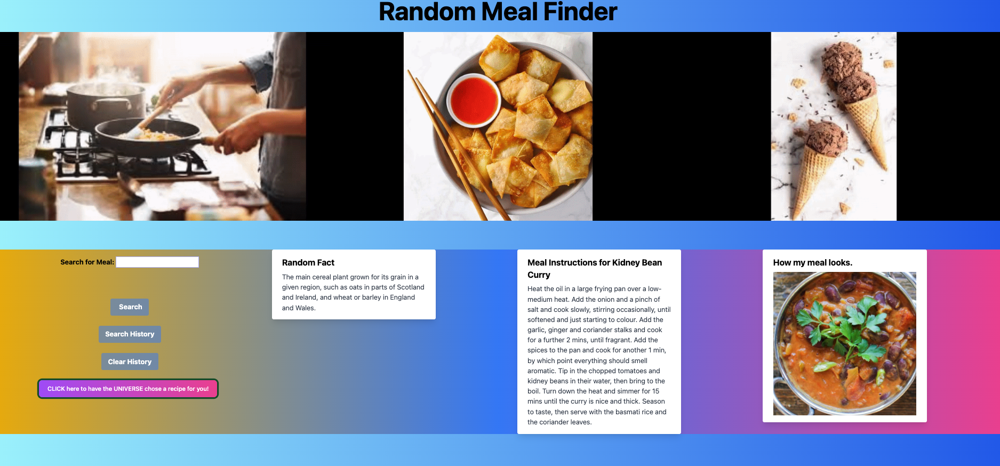
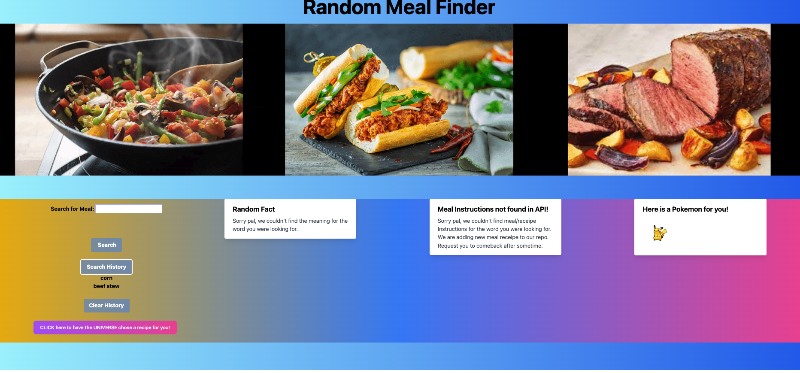

# Random-Meal-Finder-UofM

## Description
Random-Meal-Finder-UofM is a simple recipe finder application that allows you to search for a specific kind of recipe or allow the Chaos dinner button to choose for you! It also features a Random Fact section that will return an interesting fact about your search! This app will run in the browser and feature dynamically updated HTML and CSS powered by Tailwind CSS.

## Installation
To view the project in your browser:
1. You will need to clone down the repository from GitHub to your local machine. 
2. Once you have the project locally, you will need to open it in VSCode IDE. Right-click on the `index.html` file, then select `default browser` from the dropdown menu. This will open the HTML page in the broswer of your choice.

 

 

## Deployment

Application is deployed through Github Pages, live URL [Random Meal Finder Website Link](https://mlhalbert.github.io/Random-Meal-Finder-UofM/src/app)

## Features
- Dynamically updated HTML, CSS, and JavaScript powered by tailwind CSS Framework.
- Responsive user interface that adapts to multiple screen sizes.
- Unique Error Handling, now with POKEMON!
- 3 Third-Party APIs are used for a more interactive and fun UI/UX experience.

## Credits

Tutorials/Resources:

- [U of MN Coding Bootcamp Link](https://github.com/coding-boot-camp)
- [Tailwind CSS](https://tailwindcss.com/)
